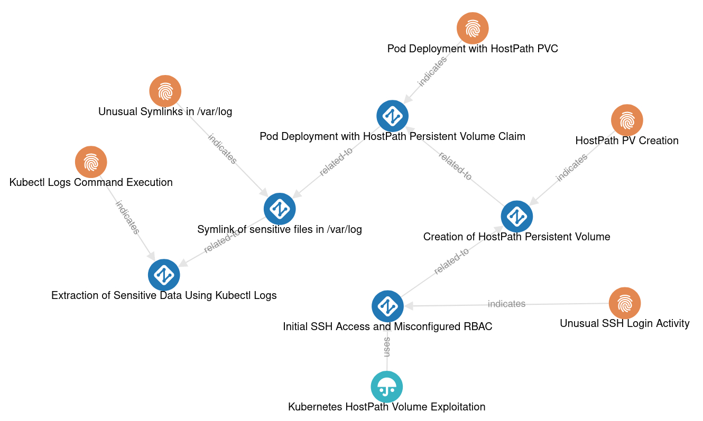
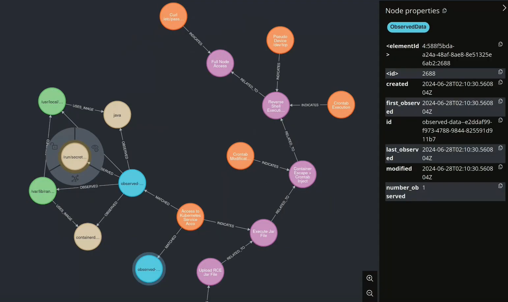

# K8sStormCenter ThreatIntel

Welcome to the K8sStormCenter ThreatIntel repository. This repository is an integral part of the K8sStormCenter project, focusing specifically on the threat intelligence aspects and offering tools and guidance needed to analyze and identify **juicy** attacks on your honeyclusters. This repository complements the [HoneyCluster](https://github.com/k8sstormcenter/honeycluster) repository, which provides the necessary tooling for deploying your own honeyclusters and baits.




## Purpose of This Repository
The primary focus of this repository is to equip users with the tools and knowledge necessary for:
- **Converting Logs**: Transforming honey cluster logs into a unified STIX format, facilitating standardized threat analysis.
- **Building Attack Models & Indicators**: Assisting users in creating their own STIX attack models and indicators necessary for identifying pertinent attacks on their clusters.
- **Matching Logic**: Featuring a runnable container that consumes honey cluster logs, assessing them against provided attack models to determine if they are attack-related.

## Repository Structure
```
.
├── pattern_matcher
│   ├── Dockerfile
│   ├── src
│   │   └── patternmatcher
│   └── README.md
│
├── stix
│   ├── examples
│   └── README.md
│
├── neo4j
├── Makefile
└── README.md
```

### Pattern Matcher
The [pattern_matcher](./pattern_matcher) directory provides a Python package which is your toolkit for transforming logs from e.g. a honey cluster to STIX models and interacting with the threat database. For detailed information take a look at the pattern matcher [README](./pattern_matcher/README.md). The pattern matcher is responsible for:

- **Transforming Logs**: Convert logs produced by a honeycluster into STIX observables.
- **STIX Management**: Manage and upload STIX attack models and indicators into the threat database.
- **Log Matching/ Threat detection**: A runnable container that consumes honey cluster logs, assessing them against provided attack models to determine if they are attack-related.

### STIX Examples
The [stix](./stix) directory provides examples and resources to help users understand how to utilize STIX data structures for their own threat intelligence and attack detection needs:
- **STIX Attacks and Indicators**: Offers examples and guidelines on defining and customizing STIX attacks and indicators. These resources should aid users in building their own attack models tailored to detect malicious behavior  their honeyclusters.
- **STIX Observables**: Examples how STIX observables from raw data may look like.


## Getting Started
Follow these detailed steps to deploy the necessary components on your honey cluster, create your attack model, upload it, and set up monitoring for your specific attack interests:


### Step 1: Deploy the Threat Database
Begin by deploying the Neo4J database which will store and manage your threat data. This rule located in [Makefile](./Makefile) will deploy neo4j to your cluster by using helm:

```bash
make install-neo4j
```

### Step 2: Deploy the Matcher Container
Once the database is set up, deploy the pattern matcher container. It consumes a stream of the logs produced by the honeycluster, looking for signs of the specific attacks you are monitoring (based on the Indicators uploaded to Neo4J, which is done in the next step). Using the following rule [resources.yaml](./pattern_matcher/resources.yaml) is applied to your cluster:

```bash
make install-matcher
```
This action creates a Kubernetes pod that runs the `k8sstormcenter/matcher` container (You can have a look at the [patternmatcher](./pattern_matcher) directory to see the pattern matchers functionality and how to build your own matcher).


### Step 3: Create and Upload Your STIX Models
Now, focus on defining what you are detecting/defending against by creating your STIX attack models and indicators:

1. **Create Your Attack Model and Indicators**: Utilize the templates and guidelines found in the `stix` directory to construct a STIX model that represents the types of attacks your system should detect.

2. **Upload Your Model**:
   - **Automated Upload**: For a quick setup, you can upload a predefined attack model [HostPath Volume Exploitation attack](./stix/examples/stix-attack-model.json) by running:
     ```bash
     make insert-attack-models
     ```
   - **Manual Upload**: If you are deploying your own attack model and indicators, upload them to the threat database using the following command:
     ```bash
     make insert-attack-models STIX_MODEL_PATH=path/to/stix/attack/model.json
     ```

### Step 4: Monitor and Verify Attacks
After setting up your models, you can either simulate an attack on the honey cluster or monitor for real attacks. To verify if an attack has been detected, use the following command to port forward to the Neo4j database on the cluster and access it on your local machine:
  ```bash
  make forward-neo4j
  ```
Once connected, navigate to `localhost:7474` in your web browser to check the database entries and see if the matcher has detected any relevant attacks as defined by your models. With some luck you should be able to see lots of colorful detected balls.

[](https://drive.google.com/file/d/1RfPr_7RmXDlU22-l7ZFoMnWJKloP0VpG/view?usp=sharing)
