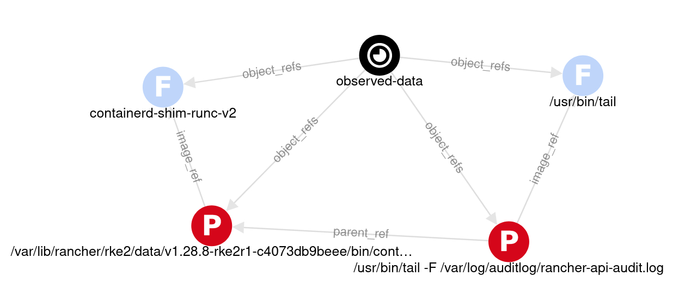
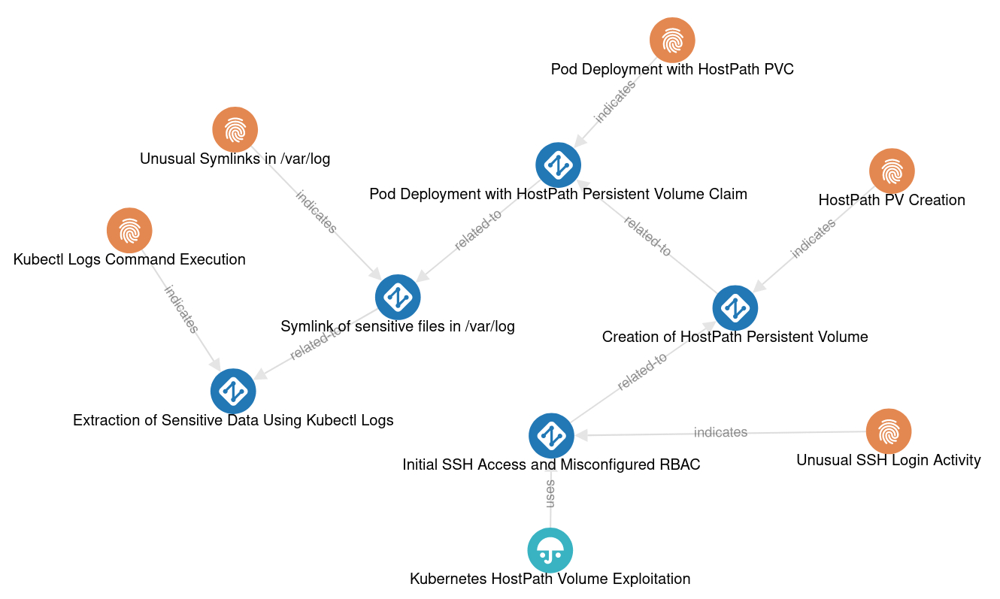

# STIX 2.1 Modeling for Tetragon Logs and Attack Tree
You can visualize and explore the STIX models mentioned in this document by drag-and-dropping the JSON files located in `/code` [in the STIX viewer](https://traut.github.io/stixview/dist/demos/viewer.html). 

## Tetragon Log
To model Tetragon logs, we utilize the STIX [Observed Data Object](https://docs.oasis-open.org/cti/stix/v2.1/os/stix-v2.1-os.html#_p49j1fwoxldc). This object references a list of STIX Cyber-observable Objects (SCOs) such as files, processes, and network addresses, capturing observed events.

For current Tetragon traces, we therefore can make use of following SCOs: [Process Object](https://docs.oasis-open.org/cti/stix/v2.1/os/stix-v2.1-os.html#_hpppnm86a1jm) to model parent and child processes and [File Objects](https://docs.oasis-open.org/cti/stix/v2.1/os/stix-v2.1-os.html#_99bl2dibcztv) to model observed binaries.

For future inclusion of Tetragon network logs, we could simply reference Network Objects in the Observed Data instead of Process Objects.



### STIX Code

```json
{
    "type": "process",
    "id": "process--5b4f20e7-76fd-4bc8-bd23-4b9c4b15a17e",
    "pid": 13312,
    "command_line": "/var/lib/rancher/rke2/data/v1.28.8-rke2r1-c4073db9beee/bin/containerd-shim-runc-v2 -namespace k8s.io -id e398dd9deb6d850fcc9327f16b3b1204135ed4ea6a27750160d340ca467fa087 -address /run/k3s/containerd/containerd.sock",
    "cwd": "/run/k3s/containerd/io.containerd.runtime.v2.task/k8s.io/e398dd9deb6d850fcc9327f16b3b1204135ed4ea6a27750160d340ca467fa087",
    "created_time": "2024-03-30T18:13:47.987328Z",
    "image_ref": "file--3c4b7b8c-2e6e-4c8b-bc5e-7c2e4b5a2d8e",
    "extensions": {
    "flags": "procFS auid",
    "parent_exec_id": "azhzLWFnZW50LTAwMjo2MDAwMDAwMDox"
    }
},
{
    "type": "process",
    "id": "process--8afdc739-2c3b-4c7e-8890-7742c0c8f8cd",
    "pid": 14287,
    "command_line": "/usr/bin/tail -F /var/log/auditlog/rancher-api-audit.log",
    "cwd": "/",
    "created_time": "2024-03-30T18:14:23.507328Z",
    "image_ref": "file--3c4b7b8c-2e6e-4c8b-bc5e-7c2e4b5a2d3l",
    "parent_ref": "process--5b4f20e7-76fd-4bc8-bd23-4b9c4b15a17e",
    "extensions": {
    "flags": "procFS auid rootcwd",
    "docker": "4b7371b1104abe7634abc1c6f00d04a",
    "container_id": "containerd://4b7371b1104abe7634abc1c6f00d04a9ab79145d6093bec2783933a206afc632",
    "pod_name": "rancher-55966c8d68-f56sc",
    "namespace": "cattle-system"
    }
},
{
    "type": "file",
    "id": "file--3c4b7b8c-2e6e-4c8b-bc5e-7c2e4b5a2d8e",
    "name": "containerd-shim-runc-v2"
},
{
    "type": "file",
    "id": "file--3c4b7b8c-2e6e-4c8b-bc5e-7c2e4b5a2d3l",
    "name": "/usr/bin/tail"
},
{
    "type": "observed-data",
    "id": "observed-data--5f2d4e5b-3d4e-4e7c-834d-437eab41a5d3",
    "created": "2024-03-30T18:14:23.507328Z",
    "modified": "2024-03-30T18:14:23.507328Z",
    "first_observed": "2024-03-30T18:14:23.507328Z",
    "last_observed": "2024-03-30T18:14:23.507328Z",
    "number_observed": 1,
    "object_refs": [
    "process--8afdc739-2c3b-4c7e-8890-7742c0c8f8cd",
    "process--5b4f20e7-76fd-4bc8-bd23-4b9c4b15a17e",
    "file--3c4b7b8c-2e6e-4c8b-bc5e-7c2e4b5a2d8e",
    "file--3c4b7b8c-2e6e-4c8b-bc5e-7c2e4b5a2d3l"
    ],
    "extensions": {
    "node_info": {
        "node_name": "k8s-agent-002"
    }
    }
}
```

### Actual Tetragon Log of the STIX objects above
```json
{
    "node_name": "k8s-agent-002",
    "process_exec": {
        "parent": {
            "arguments": "-namespace k8s.io -id e398dd9deb6d850fcc9327f16b3b1204135ed4ea6a27750160d340ca467fa087 -address /run/k3s/containerd/containerd.sock",
            "auid": 4294967295,
            "binary": "/var/lib/rancher/rke2/data/v1.28.8-rke2r1-c4073db9beee/bin/containerd-shim-runc-v2",
            "cwd": "/run/k3s/containerd/io.containerd.runtime.v2.task/k8s.io/e398dd9deb6d850fcc9327f16b3b1204135ed4ea6a27750160d340ca467fa087",
            "exec_id": "azhzLWFnZW50LTAwMjoxMjUxMjMwMDAwMDAwOjEzMzEy",
            "flags": "procFS auid",
            "parent_exec_id": "azhzLWFnZW50LTAwMjo2MDAwMDAwMDox",
            "pid": 13312,
            "start_time": "2024-03-30T18:13:47.987328791Z",
            "tid": 13312,
            "uid": 0
        },
        "process": {
            "arguments": "-F /var/log/auditlog/rancher-api-audit.log",
            "auid": 4294967295,
            "binary": "/usr/bin/tail",
            "cwd": "/",
            "docker": "4b7371b1104abe7634abc1c6f00d04a",
            "exec_id": "azhzLWFnZW50LTAwMjoxMjg2NzUwMDAwMDAwOjE0Mjg3",
            "flags": "procFS auid rootcwd",
            "parent_exec_id": "azhzLWFnZW50LTAwMjoxMjUxMjMwMDAwMDAwOjEzMzEy",
            "pid": 14287,
            "pod": {
                "container": {
                    "id": "containerd://4b7371b1104abe7634abc1c6f00d04a9ab79145d6093bec2783933a206afc632",
                    "image": {
                        "id": "docker.io/rancher/mirrored-bci-micro@sha256:a37513dd5ef92f8a05d995a9024bef02f0faedd64b91d464293a67c50fad068c",
                        "name": "docker.io/rancher/mirrored-bci-micro:15.4.14.3"
                    },
                    "name": "rancher-audit-log",
                    "pid": 1,
                    "start_time": "2024-03-30T18:14:23Z"
                },
                "name": "rancher-55966c8d68-f56sc",
                "namespace": "cattle-system",
                "pod_labels": {
                    "app": "rancher",
                    "pod-template-hash": "55966c8d68",
                    "release": "rancher"
                },
                "workload": "rancher",
                "workload_kind": "Deployment"
            },
            "start_time": "2024-03-30T18:14:23.507328761Z",
            "tid": 14287,
            "uid": 0
        }
    },
    "time": "2024-03-30T18:14:23.507328761Z"
}
```


## Attack Tree
The following shows a STIX graph representation of the HostPath-Log-Symlink Attack Tree described in the honeycluster repo, including some Indicators that should help in identifying attacker logs. More about it below:


To model a theoretical attack tree and attach helpful indicators using STIX 2.1, we utilize three STIX objects:

- [Attack Pattern](https://docs.oasis-open.org/cti/stix/v2.1/os/stix-v2.1-os.html#_axjijf603msy): Models individual attack steps (in the attack tree). We use the `related-to` relationship to indicate the order of attack steps.

```json
{
    "type": "attack-pattern",
    "id": "attack-pattern--9101mnop-qrst-uvwx-yzaa-bbccddeeffgg",
    "name": "Pod Deployment with HostPath Persistent Volume Claim",
    "description": "An attacker deploys a pod with a Persistent Volume Claim (PVC) that mounts a writable HostPath volume to a critical directory such as /var/log, allowing access to the nodes log files."
},
{
    "type": "attack-pattern",
    "id": "attack-pattern--aabbccdd-eeff-1122-3344-556677889900",
    "name": "Symlink of sensitive files in /var/log",
    "description": "An attacker symlinks senstive node files containing ssh-keys, passwords, etc.. in /var/log in order to access them."
},
{
    "type": "relationship",
    "id": "relationship--4444aaaa-5555-bbbb-6666-cccc7777dddd",
    "relationship_type": "related-to",
    "source_ref": "attack-pattern--9101mnop-qrst-uvwx-yzaa-bbccddeeffgg",
    "target_ref": "attack-pattern--aabbccdd-eeff-1122-3344-556677889900"
},

```

- [Intrusion Set](https://docs.oasis-open.org/cti/stix/v2.1/os/stix-v2.1-os.html#_5ol9xlbbnrdn): Describes common adversarial behaviors and goals. The `uses` relationship links `Attack Patterns` to the `Intrusion Set`.

```json
{
    "type": "intrusion-set",
    "id": "intrusion-set--00112233-4455-6677-8899-aabbccddeeff",
    "name": "Kubernetes HostPath Volume Exploitation",
    "description": "A sequence of attack steps aimed at exploiting misconfigurations in Kubernetes RBAC and HostPath volume settings to extract sensitive data from the cluster nodes.",
    "goals": ["Access to underlying nodes filesystem", "Extraction of sensitive data from node"]
},
{
    "type": "relationship",
    "id": "relationship--1111aaaa-2222-bbbb-3333-cccc4444dddd",
    "relationship_type": "uses",
    "source_ref": "intrusion-set--00112233-4455-6677-8899-aabbccddeeff",
    "target_ref": "attack-pattern--abcd1234-efgh-5678-ijkl-910mnopqrst"
}
```


- [Indicator](https://docs.oasis-open.org/cti/stix/v2.1/os/stix-v2.1-os.html#_muftrcpnf89v): Defines observable patterns indicating a specific attack step. Use the `indicates` relationship to link `Indicators` to `Attack Patterns`. This object may be helpful in mapping potential attack logs (Observable Data) to a certian attack step (Attack Pattern). STIX supports [multiple pattern languages](https://docs.oasis-open.org/cti/stix/v2.1/os/stix-v2.1-os.html#_9lfdvxnyofxw) including its own STIX pattern language. 

**Would be cool if there exist a STIX service or database that utilizes these patters to do direct mapping or filtering!!**
```json
{
    "type": "indicator",
    "id": "indicator--ccdd4444-5555-6666-7777-88889999aaaa",
    "name": "Unusual Symlinks in /var/log",
    "description": "Detection of symlinks to sensitive files within /var/log.",
    "pattern": "[process:command_line CONTAINS '/var/log' AND file:extensions.symlink.path MATCHES '.*(ssh|password).*']",
    "pattern_type": "stix",
    "valid_from": "2024-01-01T00:00:00Z"
},
{
    "type": "relationship",
    "id": "relationship--7777aaaa-8888-bbbb-9999-dddd0000dddd",
    "relationship_type": "indicates",
    "source_ref": "indicator--ccdd4444-5555-6666-7777-88889999aaaa",
    "target_ref": "attack-pattern--aabbccdd-eeff-1122-3344-556677889900"
}
```

